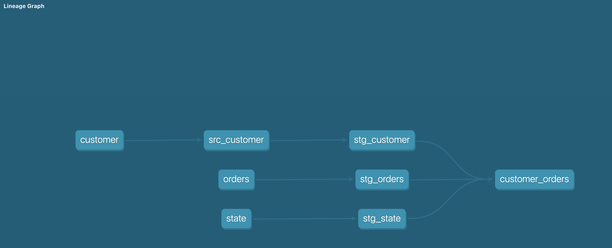

```
At Glance
```


```
## More info

Dbt Github 
https://github.com/fishtown-analytics/dbt

Dbt cli install
https://docs.getdbt.com/dbt-cli/installation

Dbt Docs
https://docs.getdbt.com/docs/building-a-dbt-project
```

```
### Demo Example (GOAL)
Data loaded by EL [Extract&Load]
```


````
T Using dbt (Using Data warehouse)
````


```bash
#Some useful options

dbt debug
dbt seed
dbt run
dbt docs generate
dbt docs serve
```

``
Lineage Graph
``


```
Concepts to explore
1. Models
2. Snapshots
3. Micros
4. Incremental modes
5. Hooks & Operations
6. Analysis

etc ....
```
